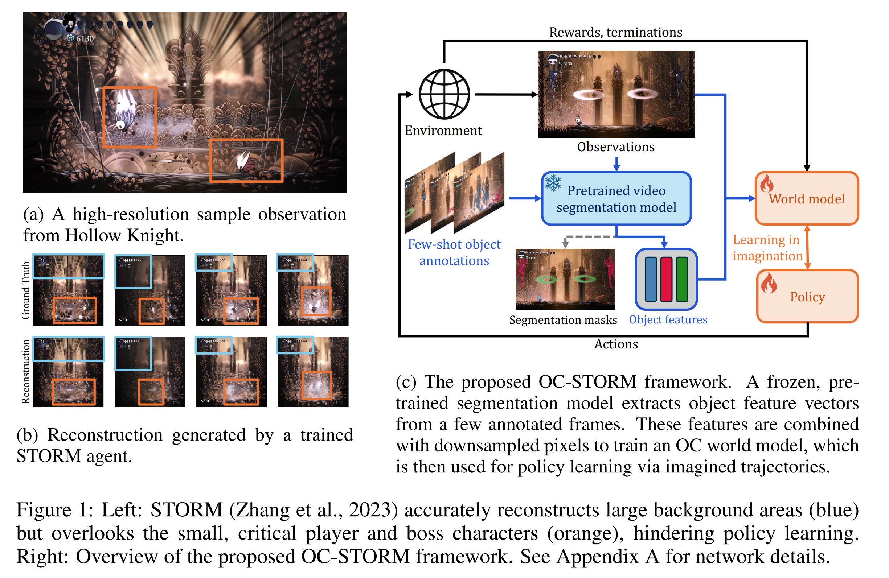

# ICLR 2026 OC-STORM

## Object-Centric World Models from Few-Shot Annotations for Sample-Efficient Reinforcement Learning [[Paper Link]](https://arxiv.org/pdf/2501.16443)

[Weipu Zhang](https://www.weipuzhang.com), [Adam Jelley](https://adamjelley.github.io/), [Trevor McInroe](https://trevormcinroe.github.io/), [Amos Storkey](https://homepages.inf.ed.ac.uk/amos/), [Gang Wang](https://ac.bit.edu.cn/szdw/jsml/mssbyznxtyjs1/224f1108f85a435d9efaaa3dc05fa536.htm)

Work was initiated at the University of Edinburgh and completed at the Beijing Institute of Technology.

[](https://www.youtube.com/watch?v=lGQLdTBY4_Q)
[](https://www.bilibili.com/video/BV123HyzuEJy)

Watch our video demo above to see the amazing fights played by RL agents!

**TL;DR: OC-STORM is an object-centric world-model RL framework that uses few-shot segmentation annotations to improve sample efficiency in Atari and Hollow Knight.**




## Environment installation

1. Create conda environment:

    ```bash
    conda create -n oc-storm python=3.12
    ```

2. Activate environment:

    ```bash
    conda activate oc-storm
    ```

3. Install Python dependencies:

    ```bash
    pip install -r requirements.txt
    ```

4. Download CUTIE model weights and segmentation masks:

    These assets are not required to run STORM itself. They are only needed for OC-STORM, and are not required if you are only interested in running STORM on Hollow Knight.

    ```bash
    bash scripts/download.sh
    ```

    Afterwards, the folder `feature_extractor/cutie/weights` should contain `coco_lvis_h18_itermask.pth` and `cutie-small-mega.pth`, and the project root should contain `segmentation_masks` folder (unless the .tar file was not extracted).

    Or download and extract manually if you prefer: [coco_lvis_h18_itermask.pth](https://github.com/hkchengrex/Cutie/releases/download/v1.0/coco_lvis_h18_itermask.pth) | [cutie-small-mega.pth](https://github.com/hkchengrex/Cutie/releases/download/v1.0/cutie-small-mega.pth) | [segmentation_masks.tar](https://github.com/weipu-zhang/OC-STORM/releases/download/v1.0/segmentation_masks.tar)

    For Atari games, the environment setup is complete after completing this step.

5. For Hollow Knight installation and configuration: [hollow_knight.md](docs/hollow_knight.md)


## Computational requirements

Most of our runs are conducted on 3090/4090, and we recommend using similar devices.

For Atari, a GPU with memory >= 11GB is preferred.


## Train, Evaluate, and Monitor

Train:

```bash
./scripts/train.sh
```

Evaluate:

```bash
./scripts/eval.sh
```

Monitor with TensorBoard:

```bash
./scripts/tensorboard.sh
```

Stop background training processes (**WARN: Read this first and use at your own risk**):

```bash
./scripts/kill.sh
```

## Citation

```bibtex
@inproceedings{
    zhang2026objectcentric,
    title={Object-Centric World Models from Few-Shot Annotations for Sample-Efficient Reinforcement Learning},
    author={Weipu Zhang and Adam Jelley and Trevor McInroe and Amos Storkey and Gang Wang},
    booktitle={The Fourteenth International Conference on Learning Representations},
    year={2026},
    url={https://openreview.net/forum?id=qmEyJadwHA}
}
```
